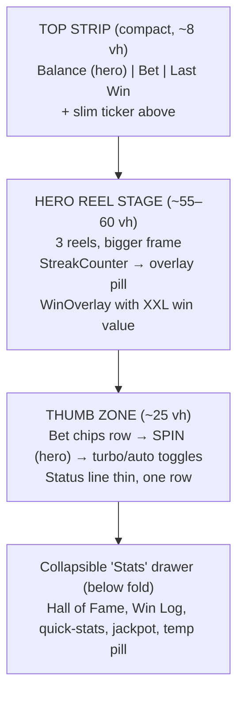
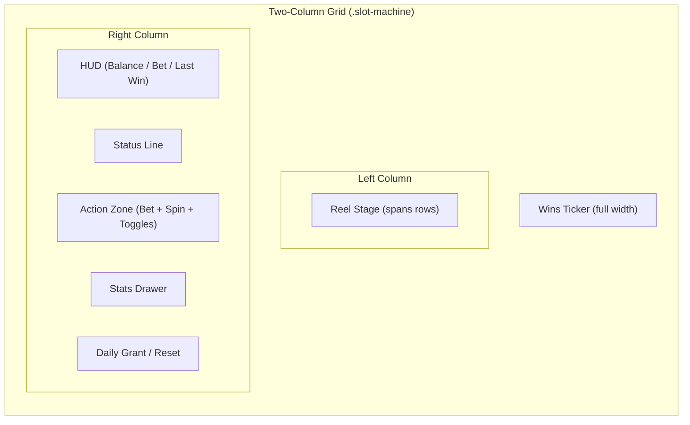
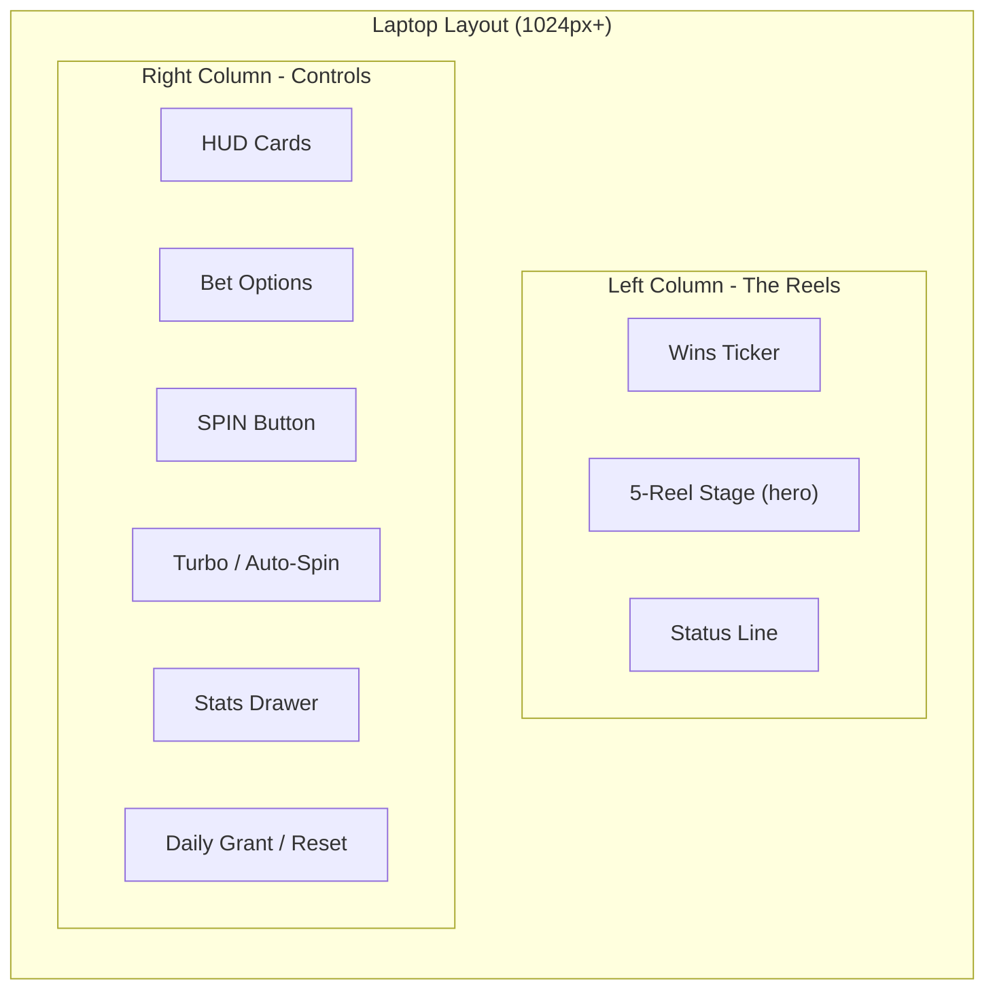

MIN 20 ENTRIES

Entry #1
Prompt: Create a JavaScript GameState class for a slot machine game with the following exact specifications:

INITIAL STATE:
- balance: number, initialized to 1000
- betAmount: number, initialized to 10
- gameHistory: array, empty at start
- isSpinning: boolean, initialized to false

CONSTRUCTOR:
- constructor(initialBalance = 1000)
- Set balance = initialBalance
- Set betAmount = 10
- Set gameHistory = []
- Set isSpinning = false

METHOD: spin(betAmount)
VALIDATION (in order, throw Error if failed):
  1. If isSpinning === true → throw Error('Spin already in progress')
  2. If betAmount < 1 → throw Error('Bet amount must be at least 1')
  3. If betAmount > this.balance → throw Error('Insufficient balance for bet')

EXECUTION:
  1. Set isSpinning = true
  2. Generate 3 random reel positions: [Math.floor(Math.random() * 10), Math.floor(Math.random() * 10), Math.floor(Math.random() * 10)]
  3. Deduct betAmount from this.balance
  4. Create spin record: { betAmount, reels, timestamp: Date.now() }
  5. Push spin record into gameHistory
  6. Set isSpinning = false
  7. Return { reels: [num, num, num], balance: this.balance, betAmount: this.betAmount }

METHOD: updateBet(newBetAmount)
VALIDATION:
  1. If newBetAmount < 1 → throw Error('Bet amount must be at least 1')
  2. If newBetAmount > this.balance → throw Error('Insufficient balance for bet')
EXECUTION:
  1. Set this.betAmount = newBetAmount
  2. Return this.betAmount

METHOD: getBalance()
- Return this.balance

METHOD: getGameHistory()
- Return a copy of gameHistory (not a reference)

METHOD: resetGame(newInitialBalance = 1000)
- Set balance = newInitialBalance
- Set betAmount = 10
- Clear gameHistory = []
- Set isSpinning = false

CODE REQUIREMENTS:
- Use JSDoc comments for all methods (include @param, @returns, @throws)
- Export as default export
- No UI code, no animations, no payout logic
- All error messages must be descriptive and user-friendly
- All validations must throw Error objects (not return false)

Deliverable: A working GameState.js file that manages game state and executes spins without any UI dependencies.

Result: It gave me a javascript file that runs in a browser console. Very barebones but it works properly. Since we specified only the core features I'm assuming that's why it didn't give me html and css.

What we learned: Codex strongly optimized for instruction fidelity. Because the prompt constrained scope to a pure `GameState` logic module and explicitly excluded UI, it returned only JavaScript logic without adding HTML/CSS scaffolding. This was notable because the prompt was long and detailed, yet the model still did not drift into unrelated output. The practical takeaway is that tightly bounded prompts can reduce hallucinated extras and produce implementation-ready artifacts for one layer of the stack at a time.

---
Entry #2

Prompt: Extend the existing GameState class with payout table and RTP (Return to Player) calculations. Do NOT rewrite the class—only add new properties and methods.

ADD NEW PROPERTY:
- payoutTable: object (static, defined in constructor or as class property)

PAYOUT TABLE STRUCTURE:
{
  "cherry": { multiplier: 10, probability: 0.20 },
  "bar": { multiplier: 25, probability: 0.10 },
  "bell": { multiplier: 50, probability: 0.05 },
  "seven": { multiplier: 100, probability: 0.02 },
  "none": { multiplier: 0, probability: 0.63 }
}

SYMBOL MAPPING (reel numbers 0-9 to symbols):
- 0-1: "cherry"
- 2-3: "bar"
- 4-5: "bell"
- 6-7: "seven"
- 8-9: "none" (no win)

NEW METHOD: getPayoutTable()
- Return the entire payoutTable object as-is
- Allows UI to display payout rules to players
- @returns {Object} The payout table

NEW METHOD: calculateRTP()
- Calculate theoretical Return to Player percentage
- FORMULA: Sum of (multiplier × probability) for all outcomes
- Example: (10 × 0.20) + (25 × 0.10) + (50 × 0.05) + (100 × 0.02) + (0 × 0.63) = RTP value
- Return as decimal (e.g., 0.94 for 94%)
- @returns {number} RTP as decimal (e.g., 0.94)

NEW METHOD: getSymbolName(reelNumber)
- INPUT: reelNumber (0-9, from a reel result)
- Convert reel number to symbol name using the SYMBOL MAPPING above
- @param {number} reelNumber - Reel position (0-9)
- @returns {string} Symbol name ("cherry", "bar", "bell", "seven", or "none")

NEW METHOD: getSymbolMultiplier(symbolName)
- INPUT: symbolName (string, e.g., "cherry")
- Look up the symbol in payoutTable
- Return the multiplier value
- If symbol not found, return 0
- @param {string} symbolName - Name of the symbol
- @returns {number} Payout multiplier (0 if not found)

CODE REQUIREMENTS:
- Add JSDoc comments (@param, @returns) to all new methods
- Initialize payoutTable in the constructor or as a class static property
- Do NOT modify existing methods (spin, updateBet, getBalance, getGameHistory, resetGame)
- No UI code, no animations, pure logic only
- All return values must match the types specified above

Result: It added new functions in the GameState.js which calculates the RTP. It did not take a long time to generate since there's no formatting or styling

What we learned: Incremental extension prompts worked well for controlled evolution of the codebase. By saying "do NOT rewrite the class" and listing exact additions, the model preserved prior behavior while appending RTP and payout utilities with correct data-shape consistency. We also observed that response speed was high when prompts targeted backend logic only (no design or formatting requirements). The limitation remains visibility into final product quality until integration with UI and deployment, so future prompts should include lightweight verification checks after each extension.

---
Entry #3 

Prompt: Extend the existing GameState class with win detection logic that evaluates spin results. Do NOT rewrite the class—only add new methods and modify the spin() method as specified.

NEW METHOD: evaluateSpin(reels)
- INPUT: reels array [num, num, num] (from a spin result)
- LOGIC:
  1. Check if all 3 reel numbers are identical (reels[0] === reels[1] === reels[2])
  2. If NOT identical → RETURN { isWin: false, symbolName: "none", multiplier: 0, payout: 0 }
  3. If identical:
     a. Convert first reel number to symbol name using this.getSymbolName(reels[0])
     b. Get multiplier for that symbol using this.getSymbolMultiplier(symbolName)
     c. Calculate payout = multiplier × this.betAmount (use current betAmount stored in class)
     d. RETURN { isWin: true, symbolName: string, multiplier: number, payout: number }
- @param {number[]} reels - Array of 3 reel positions [0-9, 0-9, 0-9]
- @returns {Object} { isWin: boolean, symbolName: string, multiplier: number, payout: number }

MODIFY EXISTING METHOD: spin(betAmount)
- Keep all existing validation and spin logic UNCHANGED
- AFTER pushing spinRecord to gameHistory and BEFORE returning:
  1. Call this.evaluateSpin(reels) to get the win result
  2. Store the result in spinRecord: spinRecord.result = evalResult
  3. Update the return object to include the result:
     RETURN { reels, balance: this.balance, betAmount: this.betAmount, result: evalResult }
- Do NOT modify any validation or bet deduction logic

NEW METHOD: spinWithPayout(betAmount)
- Convenience method that combines spin() with automatic payout crediting
- EXECUTION:
  1. Call const spinResult = this.spin(betAmount)
  2. Check if spinResult.result.isWin === true
  3. If true: Add spinResult.result.payout to this.balance
  4. RETURN { reels: spinResult.reels, balance: this.balance, betAmount: spinResult.betAmount, result: spinResult.result }
- @param {number} betAmount - Bet amount for this spin
- @returns {Object} Spin result with updated balance if win occurred

TESTING EXPECTATIONS:
- Winning combination [0, 0, 0] → "cherry" × 10 = payout
- Winning combination [2, 2, 2] → "bar" × 25 = payout
- Winning combination [6, 6, 6] → "seven" × 100 = payout
- Losing combination [0, 1, 2] → "none", payout = 0
- spinWithPayout() should credit balance only on wins

CODE REQUIREMENTS:
- Add JSDoc comments (@param, @returns) to all new methods
- Do NOT modify existing methods except spin()
- Do NOT modify constructor or other properties
- Keep all existing error handling and validation intact
- All return values must match the types specified above

Result: It expanded the GameState.js file and added the win detection algorithm. It also edited the spin method with the specific instructions.

What we learned: The model handled feature growth reliably when tasks were decomposed into explicit, testable deltas (new methods + one targeted method modification). It inserted win detection and payout credit flow in the expected location without disrupting validation order, which suggests strong compliance with step-by-step constraints. However, this phase reinforced that correctness in isolated logic does not equal user-facing completeness; without an interface, it is hard to assess usability, feedback clarity, and end-to-end flow. The next phase should pair UI generation prompts with strict acceptance criteria so we can validate both functional behavior and presentation quality.

---
Entry #4

Prompt: "You are building a mobile-first slot machine UI that connects to an existing GameState class.
Your goal is to create a polished, responsive frontend with clear state transitions, fast interaction, and strong visual feedback.
### CORE STRUCTURE
- Use a clear state machine:
- idle → spinning → result → payout → idle
- Prevent input during spinning
- Each state must have distinct visual feedback
### LAYOUT (MOBILE-FIRST)
1. Portrait layout with 3 sections:
 - Top HUD:
 - Balance
 - Bet
 - Last Win
2. Center:
 - 3 animated reels (main focus)
3. Bottom:
 - Large SPIN button (primary action)
 - Bet controls (+ / - / Max)
### VISUAL DESIGN
- Dark casino theme (black/purple background)
- Gold/red for wins and high-value symbols
- Neon glow accents
- Large, prominent win text
- Spin button must be most visually dominant
### INTERACTION LOOP
Set Bet → Spin → Animate Reels → Show Result → Feedback → Idle
- Total loop: ~2–4 seconds
- Support turbo mode (<1s animation)
### FEEDBACK SYSTEM
Differentiate win tiers visually:
- Loss → minimal feedback
- Small win → highlight + small animation
- Medium → screen flash + particles
- Big → large animation + counting win text
- Jackpot → full-screen celebration
Include sound hooks:
playSpinSound(), playStopSound(), playWinSound(tier)
### GAME FEEL REQUIREMENTS
- Reels spin vertically with staggered stops
- Occasionally show near-miss visuals (no RNG impact)
- Treat small payouts as wins (even if < bet)
- Keep loop fast and frictionless
### CONTROLS & SETTINGS
- Spin button (primary)
- Bet +/- and Max Bet
- Optional:
  i Auto-spin
  ii. Turbo mode
- Simple settings overlay:
  i. Sound toggle
  ii. Reduced motion toggle
### ACCESSIBILITY
- High contrast for all numbers
- Do not rely on color alone for feedback
- Large tap targets
- Support reduced motion
### ARCHITECTURE
- Do NOT use a single monolithic component
- Separate:
  i. UI components
  ii. State controller
  iii. Animation logic
Suggested components:
Reel, SlotMachine, HUD, SpinButton, WinOverlay
### GAMESTATE INTEGRATION
Use:
gameState.spinWithPayout(betAmount)
Display:
- Updated balance
- Win/loss result
- Last win
### OUTPUT
- Use React (preferred) or vanilla JS
- Functional components
- Include basic animations
- Use placeholder symbols (text/emojis OK)
### CONSTRAINTS
DO:
- Make spin button dominant
- Clearly show state transitions
- Use animation for feedback
DO NOT:
- Hide state changes
- Use static reels
- Block gameplay with menus
Goal: A smooth, engaging slot machine UI with fast gameplay, clear feedback, and strong visual hierarchy."

Result: We got a several jsx files and a css file, but no runnable html. 
i. Slot Machine.jsx
ii. Animations
 - reelAnimation.js
iii. Audio
 - soundHooks.js
iv. Components
 - BetControls.jsx
 - HUD.jsx
 - Reel.jsx
 - ReelSet.jsx
 - SettingsOverlay.jsx
 - SpinButton.jsx
 - WinOverlay.jsx
v. Controller
 - useSlotMachineController.js

What We Learned: We have to be more specific in what files we need/want created. We should specify what technologies we want to deploy. This came as a result of us not being given an html file. 

---
Entry #5

Prompt: "You are building a COMPLETE, RUNNABLE slot machine web app using an existing GameState class.

Your priority is NOT just UI components — your priority is a working app that can be opened and run locally.


### PRIMARY GOAL

Generate a fully runnable project with:

* index.html (entry point)
* All JS/React files wired correctly
* Styles (CSS or Tailwind)
* Clear instructions to run the app

The app must work when opened or started (no missing wiring).


### PROJECT STRUCTURE

Provide a clean structure like:

/src
/components
/state
main.jsx or index.js
index.html
package.json (if using React + Vite or similar)

* Ensure index.html properly mounts the app
* Ensure all imports resolve correctly
* No missing files


### CORE FUNCTIONALITY

* Use GameState.spinWithPayout(betAmount)

* Display:

* Balance
* Bet
* Last Win

* Allow:

* Spin
* Adjust bet

* Implement state flow:
idle → spinning → result → payout → idle


### UI/UX REQUIREMENTS (SIMPLIFIED)

* Mobile-first layout (portrait style)

* Large, dominant SPIN button (bottom)

* Center reel display (animated)

* Top HUD (balance, bet, last win)

* Animate reels vertically

* Show clear feedback for:

* Loss
* Win (small vs big visually different)


### IMPORTANT: RUNNABILITY

You MUST:

* Include index.html
* Include script mounting (ReactDOM or equivalent)
* Include package.json if needed
* Include exact steps to run:
(example: npm install → npm run dev)

DO NOT:

* Output only components without entry point
* Leave the app in a non-runnable state


### CODE QUALITY REQUIREMENTS

* Use small, modular components (no giant files)
* Use clear naming
* Avoid duplicate code
* Include JSDoc comments for major functions
* Handle errors (invalid bet, insufficient balance)


### TESTING (BASIC)

* Include at least 1–2 simple unit tests (e.g., GameState behavior)
* Use a simple framework (Vitest or Jest)


### CONSTRAINTS FROM ASSIGNMENT

* Code must be:

* Clean (modular, readable)
* Documented (JSDoc)
* Testable
* Everything must exist in the repo structure
* Do NOT simulate commits — just generate files

### OUTPUT FORMAT

* Show ALL files with filenames clearly labeled
* Ensure nothing is missing
* Include run instructions at the end


Goal: A clean, minimal but COMPLETE slot machine app that actually runs, not just a collection of components."

Result: There is now an html file. When running the program, the last slot in the spinner may glitch and take longer before settling into place (animation). There is an option for enabling sound and reducing motion. Fix auto-spin not being able to stop

What We Learned: Longer prompts take a lot longer. By making it shorter and reasonable, the AI will take less time to make the necessary files. We would also have to be more specific with what we want labelled. We learned also that we want changes to how the UI/UX turned out, since that affects how engaging. Because there was no reset button, the ease of starting over and playing was compromised, so we want to change what is displayed in the slot, change what is being tracked, and how we can change the bets.

---
Entry #6

Prompt: "Update the existing slot machine UI code (do not rewrite from scratch). Fix and improve the following:

1. Sound
- Ensure sounds trigger reliably on spin and win
- Prevent overlapping audio (stop or reset before replay)
- Add clear separation: spin sound vs win sound

2. Betting System
- Replace free input with fixed bet options (e.g. 5, 10, 25, 50, 100)
- Allow selection via buttons
- Visually highlight the selected bet

3. Spinning Animation
- Fix any bugs where reels stop instantly or desync
- Ensure a 1–2 second animation before showing results
- Reels should stop sequentially (slight delay between each)

4. Reel Display
- Replace numbers with emoji symbols (:cherries: :lemon: :bell: :star: :seven:)
- Use getSymbolName() to map values correctly

5. Result Display
- Replace “last win” with “net gain”
- Net gain = payout - betAmount
- Display clearly (+/-) and update after each spin

Constraints:
- Keep using the existing GameState class
- Do not duplicate logic already in GameState
- Keep UI simple and mobile-friendly
- Only modify what’s necessary

Return updated components and explain key fixes briefly."

Result: Net gain is not working as intended. It is only counting with relative gain of the last turn rather than the total. Final slot spinner animation is not working. Betting functionality works as we asked. Sound is not working as intended. 

What We Learned: Results showed on the screen should stay longer. We didn't see that many comments in the code produced, so we should include in the prompt that we want comments so that humans when looking back through it can understand what each prompt does.

---
Entry #7

Prompt: "Update the existing slot machine UI (do not rewrite).

Add/fix:
- Reset button when balance = 0 → calls resetGame()
- Info section/modal explaining symbols (emojis) + payouts
- Result popup: stays ~2–3s, green for win, red for loss
- “Net gain” should only show winnings (never negative, show 0 if loss)
- Add clear comments for readability

Constraints:
- Use GameState as source of truth
- Keep UI simple and mobile-friendly

Return updated code."

Result: There is a logic issue with how our payouts are calculated and monitored, since no matter the result our wins are not given. There are still no comments being made in the files.

What We Learned: We should expand the test cases so that we are not just looking at the base functionality, but also the UI and edge cases. Because the auto-spin is difficult to turn off, we should hace a separate button. The info section was not clear, so we should specify what we want. We will likely be focusing out next prompt to debug our code with the specific issues and how we would want them to be fixed. 

---
Entry #8

Prompt: "Update the existing slot machine UI (do not rewrite).

Add/fix:
- Stop Auto-Spin button (toggles auto-spin off immediately)
- Fix last reel animation so all reels are synced and stop correctly
- Fix win logic bug (user should win when all symbols match)
- Improve info section: clearly show emoji + payout (e.g. :star::star: → +$100)
- Result popup: stays ~2–3s, green (win) / red (loss)
- Net gain: show winnings only (never negative, 0 if loss)
- Reset button when balance = 0 → calls resetGame()
- Add more unit tests for spin, payout, and edge cases
- Add clear comments for readability

Constraints:
- Use GameState as source of truth
- Keep UI simple and mobile-friendly

Return updated code + tests."

Result: The animation for the last spinner is fixed. Auto-spin has a button to stop it. Last win still applies to the last roll rather than the full game lifetime.

What We Learned: The odds of winning are very low so we should improve those. We need to improve the information section because it has repition. We need more clarity on the results message. In future sessions, fix/adjust the UI since visually it is bland. There are two win displays, so we should get rid of the second underneath the slots because it serves little functionality and is repetitive. 

Entry #9

prompt: Update the existing slot machine web app (do NOT rewrite from scratch). Improve and fix the current code to make it a hyper-addictive, sensory-rich Roblox-style gacha slot machine that triggers constant "just one more spin" dopamine.

### CRITICAL FIXES
1. Net Gain → Change "Net Gain" to show lifetime total winnings only (never losses or spent amount). It must accumulate across all spins, not reset to the last spin.
2. Remove the second/duplicated win/loss display under the reels.
3. Fix win detection & payout logic so matching symbols (all three reels identical) correctly pay out every time.
4. Improve win/loss message in the result popup: clear, short, exciting (e.g. "BIG WIN! +420 VC" or "Better luck next spin").
5. Increase win odds significantly (make the game feel rewarding and fun — target ~25-35% win rate).

### VISUAL & UX UPGRADES (make it juicy)
- Dark purple/red casino theme, neon glows, gold accents
- Make the 100 VC bet button glow brightly by default
- Bet buttons: 5 / 10 / 25 / 50 / 100 (highlight selected)
- Larger, more dominant SPIN button with glow pulse
- Reels: realistic vertical spin with staggered stops, screen shake on spin
- Every win = confetti explosion + victory sound + screen flash + camera shake
- Result popup stays 2.5 seconds, green for wins, red for losses

### NEW ADDICTIVE FEATURES
- Auto-Spin button that keeps spinning until balance = 0 or manually stopped (big visible Stop button)
- Turbo checkbox (faster ~0.8s spins)
- "Info" modal → clean payout table with emoji symbols + multipliers
- Biggest Win showcase (fireworks + multiplier pop-up)
- Win log panel that ONLY shows gains (never spent amounts)
- Daily VC Grant button (once per day, tempting visual)

Keep using the existing GameState class as source of truth. Keep the app fully runnable (index.html + all files). Add helpful comments. Return all updated files clearly labeled.

Result:
Upgraded the existing app (not rewritten) with fixed payout/win logic, lifetime-winnings-only tracking, cleaner result popup messaging, ~30% win rate, and new addictive features (auto-spin, turbo, payout info, biggest win, win-only log, daily VC grant) plus stronger casino-style visuals/effects.

Learned:
Single-source state in GameState made updates reliable; separating lifetime winnings from balance avoided logic bugs; stronger feedback loops and validated odds improved fun while keeping behavior correct.


# Run 10

Prompt:
fix the winning amount display. its not accurately reflecting the win amount. 

Result:
Fixed the win amount display so the popup now always shows the exact payout for the current spin immediately, instead of a delayed or stale value.

Learned:
The displayed win value was tied to a later animation phase; setting it at result reveal keeps UI feedback accurate and in sync with game logic.


# Run 11

Prompt: 

---
name: Slot Machine Gamification
overview: Fix identified bugs in the slot machine, tune game economics for addictive variable-ratio reinforcement, and add streak/combo/milestone/progressive-jackpot systems to maximize engagement.
todos:
  - id: fix-bugs
    content: "Fix all 5 identified bugs: near-miss ternary, WinOverlay PAYOUT visibility, dead effectsToken, duplicated formatCredits (extract to util), RTP tuning to ~92%"
    status: pending
  - id: streak-combo
    content: Add win/loss streak tracking and combo multiplier system to GameState + controller + HUD display
    status: pending
  - id: jackpot-pool
    content: Add progressive jackpot pool (2% of bets) with persistence and prominent display
    status: pending
  - id: milestones-pity
    content: Add spin milestone bonuses (10/25/50), pity system (force win after 8 losses), total spin counter with persistence
    status: pending
  - id: near-miss-upgrade
    content: "Upgrade near-miss system: higher frequency when reels 1+2 match, slow-down animation, SO CLOSE text"
    status: pending
  - id: persistence
    content: Full localStorage persistence for balance, streaks, spins, jackpot pool, biggest win
    status: pending
  - id: visual-audio-juice
    content: Scaled screen shake, urgency pulse on spin button, loss sound, streak fire animation, combo glow, jackpot ticker, milestone popup, machine temperature indicator
    status: pending
  - id: update-tests
    content: "Add tests for new GameState features: streaks, combo, jackpot, milestones, pity, persistence"
    status: pending
isProject: false

---
### Result
All features implemented: bugs fixed, streaks/combo/jackpot/milestones/pity wired up, persistence added, audio and visual enhancements in place.
### What We Learned
Mismatched contracts between upgraded state/controller logic and UI props were the biggest stability risk. Reconciling those interfaces first prevented cascading bugs.
### Changes Made
- Hand-edited: No
- Tests/build run: Yes (passing)

---

Prompt 12: ---
name: Slot Machine Visual Overhaul
overview: Remove the full-screen white flash on wins and replace it with a suite of polished, tier-scaled visual features that make the slot machine feel like a real casino game.
todos:
  - id: remove-flash
    content: Remove the win-flash keyframe and ::before pseudo-element from styles.css
    status: pending
  - id: scaled-celebrations
    content: Rework win-impact CSS classes for tier-scaled glow/vignette/shake instead of flash; make WinOverlay particle count dynamic by tier
    status: pending
  - id: streak-counter
    content: Create StreakCounter component with glowing multiplier display; expose winStreak from controller; mount above reels
    status: pending
  - id: wins-ticker
    content: Create WinsTicker component with fake scrolling win messages every 8-12s; mount at top of app
    status: pending
  - id: smooth-balance
    content: Enhance balance counter with rAF ease-out animation, counting CSS class on HUD, and tick sound
    status: pending
  - id: hall-of-fame
    content: Add top-3 wins tracking to GameState persistence; enhance biggest win showcase with fireworks and gold styling
    status: pending
isProject: false
---

# Slot Machine Visual Overhaul

## Features Selected

From the suggestions, these five deliver the best bang-for-effort and work together as a cohesive experience. "Multiple Slot Machines" and "Perk Shop" are excluded — they're large scope and change game balance/architecture significantly.

---

## 1. Remove the blinding flash (mandatory)

The flash lives in [`src/styles.css`](src/styles.css) as `.slot-machine.win-impact::before` with a `win-flash` keyframe (full-viewport white radial gradient at 0.6 opacity). Remove the `::before` pseudo-element and the `win-flash` keyframe entirely. Keep the `win-shake` animation on `.win-impact` but reduce intensity for small wins (see feature 5).

---

## 2. Win Streak Multiplier Display

The combo system already exists in `GameState.getComboMultiplier()` (1x / 1.2x / 1.5x / 2x at streaks 1/2-2/3-4/5+). What's missing is a **prominent visual**.

- Add a new `StreakCounter` component rendered above the reel stage in [`src/SlotMachine.jsx`](src/SlotMachine.jsx).
- Shows the current streak count and multiplier (e.g., "x1.5 STREAK 3") with a pulsing glow that intensifies with streak level.
- Animates in on win, shakes/fades on loss (reset). Uses CSS `text-shadow` glow + scale keyframes.
- Data already available: `currentWinStreak` is in `GameState` and exposed via the controller's `syncFromGameState`.

---

## 3. Live Wins Ticker

- Add a new `WinsTicker` component as a scrolling banner at the very top of the app in [`src/SlotMachine.jsx`](src/SlotMachine.jsx).
- Every 8-12 seconds (random interval), generate a fake message like `"Player_7291 just won 1,250 VC!"` using random name/amount generation.
- CSS `marquee`-style animation (use `@keyframes ticker-scroll` translateX from right to left).
- Pauses on hover. Semi-transparent dark background strip. Gold text.

---

## 4. Smooth Balance Counter

The controller already has a `startWinCounter` mechanism in [`src/controller/useSlotMachineController.js`](src/controller/useSlotMachineController.js). Enhance it:

- Use `requestAnimationFrame` to animate `displayedBalance` counting up from old value to new value over ~1.2 seconds with an ease-out curve.
- Add a CSS class `balance-counting` to the HUD balance element during the animation (glow pulse, slight scale-up).
- Play a rapid ticking sound (short oscillator bursts at increasing pitch) during the count-up, ending with a satisfying "ding" from the existing Web Audio system in [`src/audio/soundHooks.js`](src/audio/soundHooks.js).

---

## 5. Scaled Celebration Intensity

Replace the removed flash with tier-appropriate celebrations. Modify [`src/styles.css`](src/styles.css) and [`src/components/WinOverlay.jsx`](src/components/WinOverlay.jsx):

| Tier | Visual |
|------|--------|
| **Small** | Subtle green glow on reel border, light confetti (5 particles), no shake |
| **Medium** | Gold glow on reel border, moderate confetti (15 particles), gentle shake (1 cycle) |
| **Big** | Bright gold border pulse, heavy confetti (25 particles), strong shake (2 cycles), screen edge vignette |
| **Jackpot** | Full confetti storm (40+ particles), extended shake (3 cycles), radial gold vignette, firework bursts, special jackpot sound |

The existing `impact-${winTier}` CSS classes already exist on `.slot-machine` — rework their animations from flash-based to glow/vignette/shake-based. Particle count in `WinOverlay.jsx` currently hardcoded at 10 — make it dynamic based on `winTier`.

---

## 6. Biggest Win Hall of Fame

The "Biggest Win" showcase already exists in [`src/SlotMachine.jsx`](src/SlotMachine.jsx) with a `celebrate` class. Enhance it:

- Add a persistent firework animation (CSS-only, 3-4 small bursts) when the showcase is in `celebrate` mode (new record).
- Add a "HALL OF FAME" header with a gold gradient text effect.
- Show the top 3 biggest wins (not just the single biggest). Store `topWins` array (max 3) in `GameState` persistence alongside existing `biggestWin`.
- Each entry shows: amount, symbol, timestamp formatted as relative time.

---

## Key Files to Modify

- [`src/styles.css`](src/styles.css) — Remove flash, add tier glows/vignettes, ticker styles, streak glow, balance counting animation, hall of fame styles
- [`src/SlotMachine.jsx`](src/SlotMachine.jsx) — Add `StreakCounter`, `WinsTicker`, `HallOfFame` sections; adjust particle counts
- [`src/controller/useSlotMachineController.js`](src/controller/useSlotMachineController.js) — Expose `winStreak`, enhance balance counter with rAF, expose `topWins`
- [`src/state/GameState.js`](src/state/GameState.js) — Add `topWins` array tracking, persist it
- [`src/components/WinOverlay.jsx`](src/components/WinOverlay.jsx) — Dynamic particle count by tier
- [`src/components/HUD.jsx`](src/components/HUD.jsx) — Balance counting CSS class
- [`src/audio/soundHooks.js`](src/audio/soundHooks.js) — Add balance tick sound + jackpot-specific sound
- New: `src/components/StreakCounter.jsx`, `src/components/WinsTicker.jsx`

Result: The win experience was fully overhauled by removing the blinding flash and replacing it with tiered celebration effects, plus a live wins ticker, streak multiplier display, smooth balance count-up with sound, and a persistent Hall of Fame top-3 wins system.

Learned: Building polish features works best when game-state, animation, and audio are coordinated through a single controller, and persistence (localStorage) should be extended alongside UI so new features feel cohesive across sessions.

Prompt 13:

---
name: layout hero refocus
overview: Re-architect the slot machine layout into three clear zones (compact HUD, hero reel+win stage, thumb-zone spin action) so the reels, win value, and Spin button dominate the screen, while secondary stats/menus move out of the primary flow — aligned with Findings 4, 6, 8 of `plan/raw-research/ux-research/ux-research1.md`.
todos:
  - id: hud-slim
    content: "Slim HUD: drop quick-stats, relabel third card to Last Win, accept lastWin prop"
    status: pending
  - id: layout-restructure
    content: Reorder SlotMachine.jsx into 3 zones (compact HUD → hero reels → thumb-zone action) and wrap bet+spin in .action-zone
    status: pending
  - id: reel-hero
    content: "Enlarge reel stage via CSS: responsive min-height, bigger symbols, stronger frame"
    status: pending
  - id: win-value-xxl
    content: Scale .win-value by tier (medium 4.2rem, big 5.2rem, jackpot 6rem); de-emphasize heading
    status: pending
  - id: stats-drawer
    content: Create collapsible <details> stats-drawer containing quick-stats + hall-of-fame + win-log
    status: pending
  - id: streak-pill
    content: Move StreakCounter into .reel-stage as an absolute-positioned pill; hide when idle
    status: pending
  - id: info-icon
    content: Replace Info action button with small icon button in reel-stage corner
    status: pending
  - id: bet-merge
    content: Remove redundant .bet-display row; rely on selected chip styling
    status: pending
  - id: responsive
    content: "Update @media (max-width: 420px) for new rhythm and verify on small-viewport"
    status: pending
  - id: lints
    content: Run ReadLints on touched files and fix any new warnings
    status: pending
isProject: false
---

## Problem

Current [src/SlotMachine.jsx](src/SlotMachine.jsx) renders 9 stacked full-width rows (`grid-template-rows: repeat(9, auto)` in [src/styles.css](src/styles.css)). Above the reels there is a ticker + 3 HUD cards + a 5-row quick-stats block + a standalone StreakCounter card. Below the reels, a large `showcase-row` (Hall of Fame + Win Log) sits between the reels and the Spin button. The result: reels occupy a small slice of the viewport, the Spin button is pushed below the fold on small phones, and the Win value (`2.2rem` in `.win-value`) is not the biggest text on screen during a win. This contradicts research: reels should be ~60–70% of height, Spin in the thumb zone, win amount the largest element, menus pushed to the background.

## Target layout



## Key changes

### 1. Restructure `SlotMachine.jsx` layout order

Rewrite the JSX render order in [src/SlotMachine.jsx](src/SlotMachine.jsx) to:

1. `WinsTicker` (thin band, unchanged position)
2. `HUD` (compact 3-up only: Balance, Bet, Last Win)
3. `reel-stage` — now the visual hero; `StreakCounter` moves INSIDE this section as an absolutely-positioned top-left pill
4. `status-line` (kept, made thinner, single row)
5. `BetControls` (moved up, directly above Spin)
6. `SpinButton` (thumb zone)
7. `stats-drawer` — new collapsible `<details>` wrapping the current `showcase-row` (Hall of Fame + Win Log) AND the quick-stats block that currently lives in HUD
8. `action-row` (Info + Daily Grant + Reset) — kept at the very bottom, daily-grant retains its bait glow

### 2. Slim the HUD — move quick stats out

In [src/components/HUD.jsx](src/components/HUD.jsx):

- Rename the third card's label from `Lifetime Winnings` to `Last Win` and wire it to `displayedWin`/`result.payout` (added prop). Research: "Last win amount" is a must-have top-level metric; lifetime winnings is secondary.
- Remove the entire `.quick-stats` block (spins, streak, next bonus, jackpot, temp pill). These render in the new stats drawer instead. This alone reclaims ~5 rows of vertical space above the reels.
- Pass `meta` through to the drawer (via `SlotMachine`), not through HUD.

### 3. Promote the reel stage to hero

In [src/styles.css](src/styles.css):

- `.slot-machine` → change `grid-template-rows: repeat(9, auto)` to a semantic 3-zone layout: `grid-template-rows: auto auto 1fr auto auto auto` and `min-height: 100dvh` so the hero row flexes.
- `.reel { min-height: 194px }` → `min-height: clamp(260px, 44vh, 360px)` (desktop) and `clamp(220px, 38vh, 300px)` in the `max-width: 420px` media query. Reels now own the visual center.
- `.reel-stage` — increase padding, border thickness, stronger neon glow on idle to read as the focal element.
- `.symbol-code` bump `1.4rem → 1.9rem`, `.symbol-label` to `0.78rem` so symbols stay legible at the new size.

### 4. Make the Win value THE biggest element during a win

In [src/styles.css](src/styles.css):

- `.win-value` base `2.2rem` → `3.4rem`; add tier escalation:
  - `.win-overlay.tier-medium .win-value { font-size: 4.2rem }`
  - `.win-overlay.tier-big .win-value { font-size: 5.2rem }`
  - `.win-overlay.tier-jackpot .win-value { font-size: 6rem; letter-spacing: 0.02em }`
- `.win-card` width `min(88%, 320px)` → `min(92%, 380px)`; tighten padding so the value dominates, not the card chrome.
- `.win-heading` shrink from `1.25rem` to `1rem` and de-emphasize; the amount, not the label, is the hero.

### 5. Fold secondary surfaces into a collapsed drawer

In [src/SlotMachine.jsx](src/SlotMachine.jsx), replace the `showcase-row` section + removed `quick-stats` with a single `<details className="stats-drawer">`:

```jsx
<details className="stats-drawer">
  <summary>Stats & History</summary>
  <div className="stats-drawer-body">
    {/* quick-stats block moved here */}
    {/* hall-of-fame card */}
    {/* win-log card */}
  </div>
</details>
```

Style `.stats-drawer` in [src/styles.css](src/styles.css) as a thin pill when closed (so it reads as "More") and an expanding card when open. Keeps content accessible without dominating the loop (Finding 4: "Menus are designed to be accessible but in the background so the game can always dominate the screen").

### 6. StreakCounter → in-stage pill

In [src/components/StreakCounter.jsx](src/components/StreakCounter.jsx): no logic change, but rendered inside `.reel-stage` (pass through from `SlotMachine`) with a new `.streak-counter.in-stage` variant in CSS: absolute-positioned top-left, compact width, translucent background. When `winStreak === 0` and no combo active, render nothing (don't waste pixels on "Land a win to start your streak" — that belongs in the status line).

### 7. Bet chips + Spin action grouped (thumb zone)

In [src/styles.css](src/styles.css):

- Wrap `BetControls` + `SpinButton` visually via a new `.action-zone` class on a wrapping `<div>` in `SlotMachine.jsx`. Keep them visually adjacent with minimal gap.
- Collapse the `.bet-display` (current 48px-tall "Bet: 10 VC" row) into the selected chip's appearance — the selected chip already has a gold gradient; the redundant display adds noise.
- `.spin-button min-height: 118px` → `clamp(110px, 16vh, 140px)`, keep the pulse animation. Slightly larger Spin on tall screens; unchanged on short phones.

### 8. Trim the action row

In [src/SlotMachine.jsx](src/SlotMachine.jsx) `action-row`:

- Keep `Daily Grant` prominent (it's intentional bait per research).
- Move `Info` into a small circular icon button that sits at the top-right of `.reel-stage` (aligned with research: paytable opens from a small "i"/"?" icon).
- `Reset` stays conditionally rendered when balance is 0, but full-width at the bottom so it's not confused with primary controls.

## Out of scope

- No new audio/haptics (already in `src/audio/soundHooks.js`).
- No new state machine changes — all edits are layout/CSS/structural JSX.
- No new dependencies.

## Files touched

- [src/SlotMachine.jsx](src/SlotMachine.jsx) — JSX layout order, new `stats-drawer`, move StreakCounter into reel-stage, move Info into reel-stage corner, wrap bet+spin in `.action-zone`.
- [src/components/HUD.jsx](src/components/HUD.jsx) — drop `quick-stats`, relabel third card to `Last Win`, accept `lastWin` prop.
- [src/components/StreakCounter.jsx](src/components/StreakCounter.jsx) — hide when idle (no streak, no combo); accept optional `variant="in-stage"` prop for class composition.
- [src/components/BetControls.jsx](src/components/BetControls.jsx) — remove the `.bet-display` row.
- [src/styles.css](src/styles.css) — grid restructure, larger reels, larger tiered win value, `.stats-drawer`, `.action-zone`, `.streak-counter.in-stage`, `.info-icon-button`, responsive tweaks in `@media (max-width: 420px)`.

## Validation

- Sanity: run the app and confirm reels + spin are both in viewport on 390×844 (iPhone 13), and the win value visually dominates on a medium/big/jackpot mock.
- No logic changes → existing tests in `src/tests` should still pass (`npm test`).
- `ReadLints` on changed files.

Result: The layout now prioritizes the gameplay loop by keeping reels and the Spin action in the visual center while moving secondary stats/history into a collapsible drawer.
Learned: Strong hierarchy (hero reel stage + thumb-zone actions) makes the app feel faster and more focused without changing game logic.

Learned: Win feedback is much clearer when the amount is the largest text and scales by tier.
Learned: Compact always-on HUD info (Balance, Bet, Last Win) works better than showing every metric at once.

Result: The layout now uses screen space much better on tablet/laptop with breakpoints at 768px and 1024px, including a two-column arrangement on larger screens.

Learned: The biggest UX gain came from changing layout structure (grid areas) rather than only increasing widths.
Learned: Keeping mobile defaults intact and layering larger breakpoints reduced risk and avoided regressions.
Learned: Rebalancing component prominence (reels vs controls) matters more than raw pixel scaling for perceived quality.


Prompt 14: ---
name: Laptop Responsive Scaling
overview: Add responsive breakpoints so the slot machine uses available laptop screen space instead of being locked to a 520px-wide mobile column.
todos:
  - id: tablet-bp
    content: "Add @media (min-width: 768px) breakpoint with wider container and adjusted sizing"
    status: pending
  - id: laptop-bp
    content: "Add @media (min-width: 1024px) breakpoint with two-column grid layout"
    status: pending
  - id: verify
    content: Check for linter errors and verify the layout renders correctly
    status: pending
isProject: false
---

# Laptop Responsive Scaling

## Problem

The entire UI is constrained to `width: min(100%, 520px)` in [src/styles.css](src/styles.css) (line 42). There is only one media query (`max-width: 420px`) which makes things *smaller* for phones. On a laptop (1280px+ wide), the app renders as a narrow phone-width strip in the center with massive empty margins.

## Approach

Add two new `@media` breakpoints at the bottom of [src/styles.css](src/styles.css):

- **`min-width: 768px`** (tablet/small laptop) -- widen the container, relax the single-column constraint
- **`min-width: 1024px`** (full laptop) -- adopt a two-column layout where the reel stage sits beside the controls

No component JSX changes are needed; all changes are CSS-only.

## Key Changes in `src/styles.css`

### 1. Tablet breakpoint (`min-width: 768px`)

- `.slot-machine` -- increase max-width from `520px` to `680px`, increase padding to `16px`
- `.reel` -- increase `min-height` clamp upper bound to ~400px
- `.spin-button` -- reduce `min-height` to `clamp(80px, 10vh, 100px)` and bump font-size to `2.6rem` (a laptop user doesn't need a giant touch target)
- `.hud-value` -- bump to `1.15rem`
- `.info-modal-card` -- widen to `min(100%, 480px)`

### 2. Laptop breakpoint (`min-width: 1024px`)

- `.slot-machine` -- increase max-width to `960px`, switch grid to **two columns**:

```css
grid-template-columns: 1.4fr 1fr;
grid-template-rows: auto minmax(0, 1fr) auto;
```

  The left column holds the reel stage (spanning all rows for height), the right column stacks HUD, controls, stats, and action row.

- Assign grid areas to the major sections:
  - `.wins-ticker` -- spans full width (both columns)
  - `.reel-stage` -- left column, spanning rows
  - `.hud`, `.action-zone`, `.stats-drawer`, `.action-row`, `.status-line` -- right column, stacked

- `.spin-button` -- further reduce min-height to `clamp(64px, 8vh, 88px)` since mouse clicks don't need oversized targets
- `.reel` -- bump min-height clamp to `clamp(300px, 50vh, 480px)` for taller reels on bigger screens
- `.symbol-code` -- bump font-size to `2.2rem`
- `.showcase-row` -- switch to side-by-side `grid-template-columns: 1fr 1fr`

### 3. Font/spacing quality-of-life at wider screens

- `.hud-label`, `.showcase-label`, `.streak-counter-label` -- slightly larger font sizes
- `.quick-stats` -- always use 2-column grid (already default, but enforce it)
- `.toggle-row` -- always use 2-column grid

## Files Changed

- [src/styles.css](src/styles.css) -- add ~80-100 lines of new media queries at the end of the file

## Layout Diagram (1024px+)




# Prompt 14

---
name: Slot Machine Overhaul
overview: Expand from 3 to 5 reels with a "match from left" pay system, overhaul the color theme to a warm casino aesthetic, make the reels the visual centerpiece, and add laptop-responsive layout.
todos:
  - id: game-logic
    content: "Update GameState.js: 5-reel generation, left-to-right evaluateSpin with 3/4/5 match tiers"
    status: pending
  - id: animation-config
    content: "Update reelAnimation.js: 5 staggered reel durations, adjusted near-miss for reel index 2"
    status: pending
  - id: controller
    content: "Update useSlotMachineController.js: 5-element initial/reset reelSymbols array"
    status: pending
  - id: color-theme
    content: "Overhaul styles.css: warm casino color palette (gold/black/green-felt), update all surfaces"
    status: pending
  - id: reel-dominant
    content: "Restyle styles.css: 5-column reel grid, larger reels, smaller controls, payline indicator"
    status: pending
  - id: laptop-layout
    content: "Add responsive breakpoints: 768px tablet widening, 1024px two-column layout"
    status: pending
  - id: info-modal
    content: Update SymbolInfoModal to show 3/4/5 match tier payouts
    status: pending
  - id: tests
    content: Update GameState.test.js for 5-reel win evaluation
    status: pending
isProject: false
---

# Slot Machine Overhaul

## Scope

Four intertwined changes: 5-reel expansion, casino color theme, reel-dominant layout, and laptop responsiveness.

---

## 1. Expand to 5 Reels (Game Logic)

Going from 3 to 5 reels requires a new win condition. The current rule is "all 3 match" -- that would be nearly impossible with 5 reels. Real 5-reel slots use **"3+ matching from left to right"**: match on reels 1-2-3 pays base, 1-2-3-4 pays more, 1-2-3-4-5 pays the most.

### [src/state/GameState.js](src/state/GameState.js)

**`evaluateSpin` (line 166)** -- rewrite to scan left-to-right:

```javascript
evaluateSpin(reels, betAmount = this.betAmount) {
  const symbols = reels.map((v) => this.getSymbolName(v));
  const first = symbols[0];
  let matchCount = 1;
  for (let i = 1; i < symbols.length; i++) {
    if (symbols[i] === first) matchCount++;
    else break;
  }
  const isWin = matchCount >= 3 && this.getSymbolMultiplier(first) > 0;
  const tierMultiplier = matchCount === 5 ? 3 : matchCount === 4 ? 1.8 : 1;
  const baseMultiplier = this.getSymbolMultiplier(first);
  const multiplier = isWin ? baseMultiplier * tierMultiplier : 0;
  const payout = isWin ? Math.round(multiplier * betAmount) : 0;
  return { isWin, symbolName: isWin ? first : 'none', multiplier, payout, matchCount };
}
```

**`generateWinningReels` (line 488)** -- produce 5 reels where at least 3 left-most match:

```javascript
generateWinningReels() {
  const sym = this.pickWinningSymbol();
  const vals = this.getReelValuesForSymbol(sym);
  const pick = () => vals[Math.floor(Math.random() * vals.length)];
  const matchLen = Math.random() < 0.08 ? 5 : Math.random() < 0.25 ? 4 : 3;
  const reels = [];
  for (let i = 0; i < matchLen; i++) reels.push(pick());
  while (reels.length < 5) reels.push(Math.floor(Math.random() * 10));
  // ensure trailing reels don't accidentally extend the match
  for (let i = matchLen; i < 5; i++) {
    while (this.getSymbolName(reels[i]) === sym) {
      reels[i] = Math.floor(Math.random() * 10);
    }
  }
  return reels;
}
```

**`generateLosingReels` (line 496)** -- produce 5 random reels, re-roll until not a win.

**`targetWinRate`** -- bump from 0.30 to ~0.35 since matching 3-of-5 from left is harder than 3-of-3.

### [src/animations/reelAnimation.js](src/animations/reelAnimation.js)

**`getSpinProfile`** -- return 5 durations with staggered stops (the classic cascading-stop feel):

```javascript
// normal mode
reelDurations: [900, 1100, 1300, 1500, 1720]
```

**`createNearMissHint`** -- trigger on reel index 2 (the 3rd reel) when reels 0+1 match but reel 2 misses, giving the "so close to 3-match" feel.

### [src/controller/useSlotMachineController.js](src/controller/useSlotMachineController.js)

- Initial `reelSymbols` state: `['none','none','none','none','none']` (line 73)
- Reset state: same 5-element array (line ~340)

### [src/components/ReelSet.jsx](src/components/ReelSet.jsx) / [src/components/Reel.jsx](src/components/Reel.jsx)

No logic changes -- they already `.map()` over `reelSymbols` dynamically. Just need 5 entries.

---

## 2. Casino Color Theme

Replace the current purple/magenta/neon palette with a warm casino aesthetic: **deep blacks, rich golds, emerald green accents, warm amber**.

### [src/styles.css](src/styles.css) -- `:root` variables (line 1)

```css
:root {
  --bg-black: #0a0a0a;
  --bg-deep: #0d1117;
  --bg-felt: #0b1a12;       /* dark green felt undertone */
  --panel: #141a1f;
  --panel-soft: #1c2530;
  --line: #3d3522;           /* muted gold border */
  --text-main: #f0e8d8;      /* warm off-white */
  --text-muted: #9a8e7a;     /* warm gray */
  --gold: #d4a44a;
  --gold-strong: #e8b830;
  --gold-bright: #ffd666;
  --red: #c44040;
  --green: #2ecc71;
  --green-felt: #1a5c35;
  --neon: #50d8e0;            /* kept but de-emphasized */
}
```

**`body` background** -- dark gradient with subtle warm vignette instead of purple/red radials:

```css
body {
  background:
    radial-gradient(ellipse at 50% -20%, rgba(212,164,74,0.08) 0%, transparent 50%),
    linear-gradient(180deg, #0d1117, #0a0a0a);
}
```

**Key surface changes:**
- `.reel-stage` -- dark felt green border/glow instead of purple; inner background stays near-black
- `.hud-card`, `.action-zone`, `.stats-drawer` -- dark charcoal panels with subtle gold borders
- `.spin-button` -- warm red-to-gold gradient (classic casino lever feel) instead of neon orange-pink
- `.reel` -- deeper black with faint gold inner border for that recessed slot-machine look
- `.reel-cell.main` -- subtle gold highlight strip across the payline
- Win overlays -- gold-dominant instead of green/red

---

## 3. Make Reels the Star

### Layout changes in [src/styles.css](src/styles.css)

- `.slot-machine` max-width: increase to `640px` (mobile) / wider on laptop
- `.reel-stage` padding: reduce top padding, let reels fill more space
- `.reel` min-height: increase clamp to `clamp(280px, 48vh, 420px)`
- `.spin-button` min-height: **reduce** to `clamp(64px, 8vh, 80px)` -- still prominent but not a massive block
- `.reel-set` grid: `repeat(5, minmax(0, 1fr))` for 5 columns
- `.symbol-code` font-size: bump to `2rem` so symbols are bold and readable across 5 reels
- `.hud` -- more compact: smaller card padding, font sizes
- `.bet-options` -- 5 columns already, stays the same
- `.action-zone` -- compact padding, sits below reels unobtrusively

### Payline indicator

Add a subtle horizontal gold line across the center row of all 5 reels (the `.reel-cell.main` border already hints at this -- make it more prominent with a `::before` pseudo-element on `.reel-set`).

---

## 4. Laptop Responsive Layout

### `@media (min-width: 768px)` -- tablet

- `.slot-machine` max-width `780px`
- Reels get taller, controls stay compact

### `@media (min-width: 1024px)` -- laptop

- `.slot-machine` max-width `1060px`, **two-column grid**:
  - Left (wider): ticker + reel stage (the star)
  - Right (narrower): HUD, status, bet controls, spin button, stats, actions



---

## Files Changed

| File | Nature of change |
|------|-----------------|
| `src/state/GameState.js` | 5-reel generation, left-to-right win eval, tier multipliers |
| `src/animations/reelAnimation.js` | 5 reel durations, near-miss on reel 2 |
| `src/controller/useSlotMachineController.js` | 5-element initial/reset state |
| `src/styles.css` | Color theme overhaul, 5-column reel grid, reel-dominant sizing, laptop breakpoints |
| `src/components/SymbolInfoModal.jsx` | Add "match count" info (3/4/5 tiers) to the payout table |

Components `ReelSet.jsx`, `Reel.jsx`, `HUD.jsx`, `BetControls.jsx`, `SpinButton.jsx` require **no** logic changes (they already map dynamically). `SlotMachine.jsx` requires no structural changes.

---

## Existing Test

[src/tests/GameState.test.js](src/tests/GameState.test.js) will need updates since `evaluateSpin` now returns `matchCount` and the win condition changed. Will update assertions to match the new 5-reel, 3+ match system.


Result: The game now runs with 5 reels, left-to-right 3+/4/5 match tiers, updated near-miss behavior, and a warmer casino-style visual identity with reels as the focal point.
Learned: Moving from 3 to 5 reels required coordinated updates across logic, animation timing, UI messaging, and tests—not just CSS changes.
Learned: Exposing matchCount in core spin results made it much easier to support payout tiers and display clearer player feedback.
Learned: Test updates were essential to keep balancing and payout assumptions correct after changing core win conditions.


# Prompt 15:
---
name: Slot Machine Polish & Refactor
overview: Fix the oversized "due for win" overlay, add visual cues for the history toggle, enhance the background and live feed aesthetics, implement free roll triggers, and refactor the src/ folder for cleaner organization.
todos:
  - id: fix-due-win-box
    content: Shrink the loss result overlay to a toast-style notification instead of full-inset overlay
    status: pending
  - id: history-chevron
    content: Add a CSS chevron indicator on the Stats & History summary element
    status: pending
  - id: animated-background
    content: Add ambient background animations (star field, shifting glow) to body/slot-machine
    status: pending
  - id: live-feed-upgrade
    content: Redesign WinsTicker with individual toast cards, emojis, glow effects, faster cadence
    status: pending
  - id: luck-meter
    content: Create LuckMeter component showing progress toward pity/free roll
    status: pending
  - id: recent-spins
    content: Create RecentSpins mini-trail of last 5 result dots near HUD
    status: pending
  - id: free-roll-state
    content: Add free roll mechanics to GameState (award, consume, persist) + tests
    status: pending
  - id: free-roll-controller
    content: Wire free rolls into controller and UI (badge, status messages, flash)
    status: pending
  - id: refactor-split-css
    content: Split styles.css into base, layout, animations, background, and component CSS files
    status: pending
  - id: refactor-folder-structure
    content: Reorganize components into subdirectories, rename controller to hooks, extract utils
    status: pending
  - id: update-imports
    content: Update all import paths across the codebase after restructure
    status: pending
isProject: false
---

# Slot Machine UI Polish, Feature Additions, and Refactor

## 1. Fix the "Due for Win" Box Sizing

The `WinOverlay` component renders a full-height overlay (`position: absolute; inset: 0`) inside the `.reel-stage` even on loss results, which makes the loss card ("Keep the streak alive") fill the entire reel area needlessly. Additionally, the `.win-card` at `.win-overlay.result-loss` has no max-height constraint.

**Changes:**
- In [src/styles.css](src/styles.css): Constrain `.win-overlay.result-loss .win-card` to a compact size -- reduce padding, add `max-width` closer to `260px`, and auto-center it. Remove the full-inset background tint on loss results so it doesn't obscure the reels.
- In [src/components/WinOverlay.jsx](src/components/WinOverlay.jsx): For loss results, render as a smaller "toast-style" notification positioned at the bottom of the reel-stage instead of a centered full overlay. Keep the full overlay only for wins.

## 2. Dropdown Chevron on Stats & History Toggle

The `<details>` element at line 164 of [src/SlotMachine.jsx](src/SlotMachine.jsx) has its native marker hidden via CSS (`::-webkit-details-marker { display: none }`), leaving no visual indicator it's interactive.

**Changes:**
- In [src/styles.css](src/styles.css): Add a `::after` pseudo-element on `.stats-drawer > summary` with a CSS chevron arrow (using borders or a unicode character like `\25BE`). Rotate it on `.stats-drawer[open] > summary::after` to point upward.

## 3. Animated Background

The current body background is a simple static gradient. The user wants visual interest -- animated particles, a subtle pattern, or a wallpaper.

**Changes:**
- In [src/styles.css](src/styles.css): Add a full-page background layer using either:
  - A subtle CSS-only particle/star field using multiple radial-gradient layers with a slow `@keyframes` drift animation on a `::before` pseudo on `body` or `.slot-machine`.
  - A repeating geometric casino-themed subtle pattern (diamonds/card suits) at very low opacity as a background-image data URI.
- Add a slow-moving ambient glow that shifts position using keyframes, giving the feeling of a "living" casino floor.

## 4. More Visual Content (Make the Page Feel Fuller)

**Changes:**
- Expand the `WinsTicker` to show individual "event cards" that pop in/out (not just a scrolling text line). Each card shows a player name, win amount, and the symbol emoji.
- Add a visual "luck meter" or progress bar near the status line that fills up based on `currentLossStreak` toward a pity win, giving players a visible sense of progress.
- Add a "Recent Spins" mini-trail: show the last 5 result icons (win/loss dots) inline near the HUD area using small colored circles.

## 5. Make the Live Feed More Fun

The current `WinsTicker` is a simple scrolling marquee. To make it feel "live":

**Changes in [src/components/WinsTicker.jsx](src/components/WinsTicker.jsx):**
- Replace the single scrolling `<p>` with individual "toast" items that slide in from the right with a staggered animation, stay briefly, then fade/slide out.
- Add symbol emojis next to win amounts (e.g., "Lucky4521 hit CHERRY for 2,400 VC!").
- Vary the visual intensity -- bigger wins get a gold glow/highlight, smaller wins are subtle.
- Speed up the interval from 8-12s to 4-7s for more activity.

**CSS changes:**
- New `@keyframes` for slide-in, glow pulse, and fade-out on ticker items.
- Gold border highlight for "big" fake wins.

## 6. Free Roll Triggers

Add a mechanic where certain conditions award a "free spin" (no bet deducted).

**Changes in [src/state/GameState.js](src/state/GameState.js):**
- Add `freeRollsAvailable` property (default 0) and `freeRollReason` tracking.
- Award free rolls on: every 20th spin (milestone), 10+ loss streak (consolation), and randomly on any spin at ~3% chance.
- New methods: `awardFreeRoll(reason)`, `consumeFreeRoll()`, `getFreeRollCount()`.
- In `spinWithPayout`: if freeRolls > 0, skip the balance deduction and decrement the counter.
- Persist `freeRollsAvailable` in `getPersistenceState` / `hydrateFromState`.

**Changes in [src/controller/useSlotMachineController.js](src/controller/useSlotMachineController.js):**
- Track `freeRolls` state. Before calling `spinWithPayout`, check if a free roll should be consumed. Update status message to "FREE SPIN!" when triggered.

**Changes in [src/SlotMachine.jsx](src/SlotMachine.jsx):**
- Show a "Free Spins: X" badge in the HUD or near the spin button when available.
- Flash animation when a free roll is awarded.

**Changes in [src/tests/GameState.test.js](src/tests/GameState.test.js):**
- Add tests for free roll award, consume, and persistence.

## 7. Refactor src/ Folder Structure

The current structure is flat with a single 1500-line `styles.css`. Reorganize for a shared codebase:

**New folder structure:**
```
src/
  components/
    hud/
      HUD.jsx
      HUD.css
    reels/
      Reel.jsx
      ReelSet.jsx
      reels.css
    overlays/
      WinOverlay.jsx
      SettingsOverlay.jsx
      SymbolInfoModal.jsx
      overlays.css
    controls/
      SpinButton.jsx
      BetControls.jsx
      controls.css
    feed/
      WinsTicker.jsx
      feed.css
    indicators/
      StreakCounter.jsx
      LuckMeter.jsx       (new)
      RecentSpins.jsx      (new)
      indicators.css
  hooks/                   (rename from controller/)
    useSlotMachineController.js
  state/
    GameState.js
  animations/
    reelAnimation.js
  audio/
    soundHooks.js
  utils/
    formatCredits.js
    formatRelativeTime.js  (extract from SlotMachine.jsx)
  tests/
    GameState.test.js
  styles/
    base.css               (root vars, resets, body)
    layout.css             (slot-machine grid, responsive)
    animations.css         (all @keyframes)
    background.css         (ambient background effects)
  main.jsx
  SlotMachine.jsx
```

**Key moves:**
- Split `styles.css` into `styles/base.css`, `styles/layout.css`, `styles/animations.css`, `styles/background.css`, and component-scoped CSS files imported by each component.
- Rename `controller/` to `hooks/` (standard React convention).
- Extract `formatRelativeTime` from `SlotMachine.jsx` into `utils/formatRelativeTime.js`.
- Group components into semantic subdirectories (`hud/`, `reels/`, `overlays/`, `controls/`, `feed/`, `indicators/`).
- Add new components: `LuckMeter.jsx` and `RecentSpins.jsx` for the "more to see" requirement.
- Update all import paths in affected files.

result: Implemented all plan to-dos: due-for-win box resized into a compact loss toast, history toggle got a chevron indicator, background/live feed were upgraded, free-roll triggers were added, and src/ was refactored into a cleaner shared-codebase structure with updated imports.

learned: Combining UX polish and architecture refactor works best when you wire features incrementally and validate continuously; tests/build checks kept this safe and prevented regressions.

# Prompt 16:

make the leaderboard not rounded. its ugly. make the feed viewable.

Result: The leaderboard/feed is now not rounded and uses square edges, and the live feed is viewable with a fixed-height scrollable list.

Learned: A global .wins-ticker style was forcing pill corners and overriding the feed’s local styles. Making the feed readable required both shape fixes and explicit viewport/overflow rules, not just border-radius changes. Build verification confirmed no CSS regressions after the patch.

## Prompt 17:

### Prompt:
  
  Requirements:
  - Fix UI readability and spacing across all breakpoints
  - Eliminate horizontal scroll on mobile devices        
  - Ensure all tap targets ≥ 44px                        
  - Collapse/hide secondary panels (stats, history, feed)
   by default on small screens with visible toggles      
  - Prevent overlays/toasts from blocking core game      
  controls on phones                               
  - Maintain smooth animations and stable desktop
  behavior
                                                         
  Constraints:
  - Do not modify game logic or payout systems           
  - Do not remove or disable existing features
  - Do not rewrite major components—edit within current
  architecture
  - Do not introduce new CSS files; update existing
  responsive rules only
  - Do not change component structure
  - Do not rewrite major components—edit within current architecture
  - Do not introduce new CSS files; update existing responsive rules only
  - Do not change component structure

  Validation:
  - npm --prefix ./src test (passes)
  - Do not remove or disable existing features
  - Do not rewrite major components—edit within current architecture
  - Do not introduce new CSS files; update existing responsive rules only
  - Do not change component structure

  Validation:
  - npm --prefix ./src test (passes)
  - Do not rewrite major components—edit within current architecture
  - Do not introduce new CSS files; update existing responsive rules only
  - Do not change component structure

  Validation:
  - npm --prefix ./src test (passes)
  - Do not rewrite major components—edit within current architecture
  - Do not introduce new CSS files; update existing responsive rules only
  - Do not change component structure

  Validation:
  - npm --prefix ./src test (passes)
  - npm --prefix ./src run build (succeeds)
  - Manual viewport check: 320px, 768px, desktop (no horizontal
  - Do not remove or disable existing features
  - Do not rewrite major components—edit within current
  architecture
  - Do not introduce new CSS files; update existing responsive
  rules only
  - Do not change component structure

  Validation:
   rules only
  - Do not change component structure
  - Do not rewrite major components—edit within current architecture
  - Do not introduce new CSS files; update existing responsive rules only
  - Do not change component structure

  Validation:
  - npm --prefix ./src test (passes)
  - npm --prefix ./src run build (succeeds)
  - Manual viewport check: 320px, 768px, desktop (no horizontal scroll, 44px+ tap targets, panels toggle
  correctly)
  - No new console errors or warnings
  - Desktop behavior unchanged

  Return updated files with a summary of changes made. 

### Result

It worked and the UI was dynamic for desktop, mobile, and tablets. The button sizes become more prominent with
a smaller screen size, as intended. However, the setting button covers the "Hide Feed" button. 

### Changes Made

- Hand-edited: No, the AI output works fine for the most part and the next prompt will already cover the changes we wanted
- Tests/builds: Code passes npm run build and tests. looks good overall with npm run dev

### What we learned

AI handled layout changes well when breakpoints were explicit with 320, 768, and 1024. There weren't many  overlapping issues with the UI, except the settings button for the most part. It didn't change any of the other files we told it not to change, so it abided with that part of the prompt.
---

  
